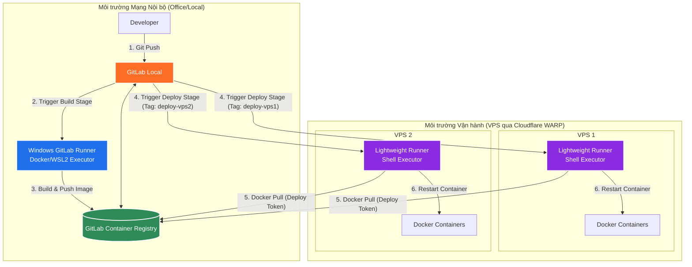

# Kiến trúc CI/CD GitLab Tối ưu hóa Hiệu năng & Bảo mật

Tài liệu này phân tích chi tiết giải pháp chuyển dịch gánh nặng build CI/CD từ các VPS cấu hình yếu sang máy Windows nội bộ (kết nối trực tiếp LAN), đồng thời tối ưu hóa bảo mật và hiệu năng cho hệ thống vận hành từ xa sử dụng **Cloudflare WARP**.

---

## 1. Phân tích Mô hình Đề xuất

### Mô hình Hiện tại (Đang gặp nghẽn)
* **Cách hoạt động**: Mỗi VPS tự chạy GitLab Runner riêng. Khi có code mới, VPS tự kéo code về, chạy lệnh `docker build` (ngốn cực kỳ nhiều CPU/RAM/Disk I/O) và deploy trực tiếp.
* **Hậu quả**: VPS bị nghẽn phần cứng (đặc biệt là CPU và RAM) trong suốt quá trình build, gây gián đoạn hoặc làm chậm các dịch vụ đang chạy trên VPS.

### Mô hình Mới (Đề xuất)
* **Cách hoạt động**:
  * **Máy Windows nội bộ** (phần cứng mạnh) được cài đặt GitLab Runner tập trung đóng vai trò **Builder**. Runner này sẽ clone code, thực hiện các bước kiểm thử (test) và đóng gói thành Docker Image, sau đó `push` lên **GitLab Container Registry** tích hợp sẵn của GitLab Local.
  * **Các VPS** chỉ cần chạy một **Lightweight Runner (Shell Executor)** cực nhẹ để thực hiện việc `pull` Docker Image từ GitLab Registry nội bộ (qua đường truyền WARP) về chạy.
* **So sánh hiệu năng**:
  | Tiêu chí | Mô hình cũ (Build trên VPS) | Mô hình mới (Build tập trung) |
  | :--- | :--- | :--- |
  | **CPU/RAM VPS khi build** | Tăng vọt lên 90% - 100% | Gần như không đổi (~1-3% để pull image) |
  | **Thời gian Downtime/Lag** | Cao (do tranh chấp tài nguyên) | Gần như bằng 0 |
  | **Bảo mật mã nguồn** | Thấp (Mã nguồn nằm trên VPS) | Cao (Chỉ có Image đã đóng gói trên VPS) |
  | **Khả năng scale** | Khó khăn (Mỗi VPS phải cấu hình build) | Rất dễ (Thêm VPS chỉ cần pull image) |

---

## 2. Luồng Thực hiện (Workflow Diagram)

Dưới đây là luồng CI/CD tối ưu, phân tách rõ ràng giữa pha **Build (trên Windows)** và pha **Deploy (trên VPS)**:

---

## 3. Giải pháp Bảo mật Tối ưu

Để đảm bảo an toàn tuyệt đối khi kết nối giữa máy Windows nội bộ, GitLab Local và các VPS qua WARP, cần áp dụng các nguyên tắc sau:

> [!IMPORTANT]
> **Không sử dụng SSH Key tập trung trên Runner máy Windows để SSH vào VPS deploy.**
> Nếu máy Windows Runner bị hack, kẻ tấn công sẽ có private key để truy cập toàn bộ các VPS. Thay vào đó, hãy dùng mô hình **GitLab Runner kéo (Pull-based)**: Cài đặt GitLab Runner dạng siêu nhẹ (Shell Executor) ngay trên từng VPS. GitLab Local sẽ ra lệnh cho VPS tự chạy lệnh deploy của chính nó qua kết nối HTTPS an toàn của GitLab.

### Các biện pháp bảo mật cụ thể:
1. **Sử dụng Deploy Tokens (Quyền tối thiểu - Least Privilege)**:
   - Không dùng tài khoản cá nhân hoặc mật khẩu chính để pull image trên VPS.
   - Tạo **Deploy Token** riêng cho từng dự án hoặc từng VPS trên GitLab với quyền duy nhất là `read_registry`.
   - Nếu một VPS bị tấn công, kẻ xấu chỉ lấy được token đọc image của dự án đó, không thể ghi đè (push) image độc hại lên Registry và không thể xem mã nguồn.
2. **Bảo mật Kênh truyền thông qua WARP**:
   - Cấu hình GitLab Local chạy trên giao thức **HTTPS** (sử dụng chứng chỉ SSL nội bộ hoặc tự cấp phát nếu cần).
   - Đảm bảo Cloudflare WARP được cấu hình chỉ cho phép các dải IP của VPS truy cập vào cổng Registry và GitLab.
3. **Cô lập môi trường Build**:
   - Trên máy Windows Runner, cấu hình chạy Docker Executor chạy dưới dạng container cô lập hoặc chạy trong WSL2 (Windows Subsystem for Linux) để tránh việc tiến trình build CI/CD can thiệp trực tiếp vào hệ điều hành Windows của công ty.
