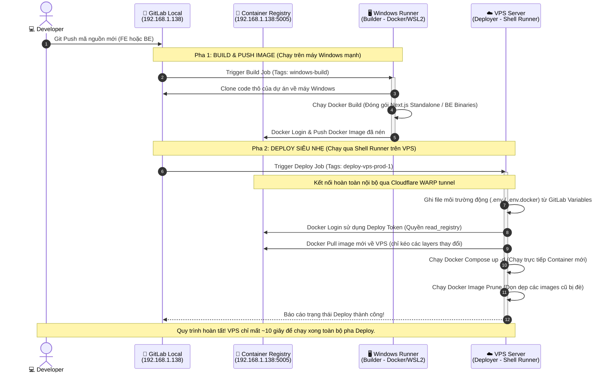

# Sơ đồ Luồng Hoạt động (CI/CD Workflow Diagram)

Tài liệu này trực quan hóa toàn bộ luồng truyền tải dữ liệu, mã nguồn và điều phối công việc giữa **GitLab Local**, **Windows Runner (Builder)** (kết nối trực tiếp LAN nội bộ) và các **VPS (Deployer)** (kết nối an toàn qua **Cloudflare WARP**).

---

## 1. Sơ đồ Mermaid Flowchart

Bạn có thể xem sơ đồ trực quan dưới đây (hoặc xem trực tiếp trên các trình đọc Markdown hỗ trợ render Mermaid như VS Code, GitLab UI):

---

## 2. Giải thích Chi tiết Các Bước trong Luồng

1. **`Git Push`**: Lập trình viên đẩy code mới lên một chi nhánh cụ thể (ví dụ: `main` hoặc `develop`).
2. **`Trigger Build Job`**: GitLab Local phát hiện sự thay đổi và kích hoạt pha `build`. Nhờ tag `windows-build`, GitLab chỉ định máy Windows nội bộ chịu trách nhiệm chạy job này.
3. **`Clone Code`**: Windows Runner tải mã nguồn gốc về môi trường ảo hóa Docker (hoặc WSL2) trên Windows.
4. **`Docker Build`**: Thực hiện cài đặt thư viện và biên dịch (đối với FE là Next.js Standalone, đối với BE là build binaries) ngay trên tài nguyên phần cứng mạnh của máy Windows.
5. **`Push Image`**: Đóng gói thành công, Windows Runner đẩy (push) image hoàn chỉnh trực tiếp qua mạng LAN nội bộ lên **GitLab Container Registry** nội bộ (`192.168.1.138:5005`) qua giao thức HTTP (tận dụng băng thông gigabit nội bộ siêu tốc).
6. **`Trigger Deploy Job`**: Pha build thành công sẽ tự động kích hoạt pha `deploy`. Nhờ tag `deploy-vps-prod-1`, job này được gửi trực tiếp đến **Lightweight Shell Runner** đang lắng nghe trên VPS.
7. **`Write Env Files`**: Shell Runner trên VPS tự động trích xuất các cấu hình nhạy cảm từ GitLab Variables và ghi đè vào các tệp tin `.env` nội bộ trên VPS.
8. **`Docker Login (Deploy Token)`**: VPS đăng nhập vào Registry bằng tài khoản Deploy Token (chỉ có quyền đọc - `read_registry`).
9. **`Docker Pull`**: VPS kéo image mới từ Registry nội bộ về. Quá trình này diễn ra cực kỳ nhanh nhờ công nghệ phân lớp (layers) của Docker (chỉ tải về những dòng code có sự thay đổi).
10. **`Docker Run / Compose`**: Chạy container mới từ image vừa kéo về để phục vụ người dùng.
11. **`Prune Images`**: Tự động dọn dẹp các bản build cũ để giải phóng dung lượng ổ cứng cho VPS.
12. **`Deploy Success`**: Runner báo cáo trạng thái hoàn thành pipeline lên GitLab UI.
